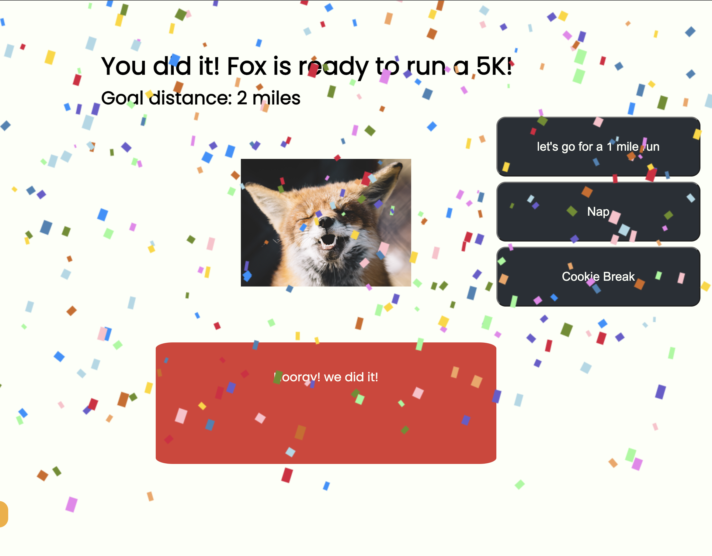

## 5k Fox

## Game Style: Digital pet

#### Objective: 
Using run, nap, and cookie buttons, help Fox meet goals to prepare for running a 5k.

#### Summary:

It's a digital pet with a dream! Fox doesn’t just want you to take care of them, they want you to help train for a 5k.  Take Fox for regular runs, make sure they get rest, and feed them their favorite treat.  If Fox doesn't get rest and treats, they will get too tired to complete their mileage goal and you will have to repeat the previous “week”.

Fox’s daily run quota is loosely based on a couch to 5k model, so it will increase as the game progresses. If Fox meets the distance goals for each week, they will be ready to run a 5k, and you win the game!

#### Getting started: 
game link:
https://5k-fox.netlify.app/

Original wireframe:

Mobile version at game start:

Desktop version winning:

#### Technologies used

- html 
- css
- javascript

#### External sources

- Text animation via animate.css 
- Opening fox photo by Olga Kononenko via Unsplash 
- Closeup photo of fox face by Peter Lloyd via Unsplash 
- Photo of fox in a parking lot by Freezer via Unsplash 
- Audio file 'Game Win' by elijahdanie via freesound.org
- Favicon from favicon.io
- Google font: Poppins

#### Sample of a couch to 5k plan
https://www.runnersworld.com/uk/training/5km/a760067/six-week-beginner-5k-schedule/

#### Next Steps
I would like to evolve this into a running accountability program.  Instead of having a distance assigned to the 'run' button, a person would log their own mileage from a run.  These user-created logs would accumulate towards a weekly mileage goal.

